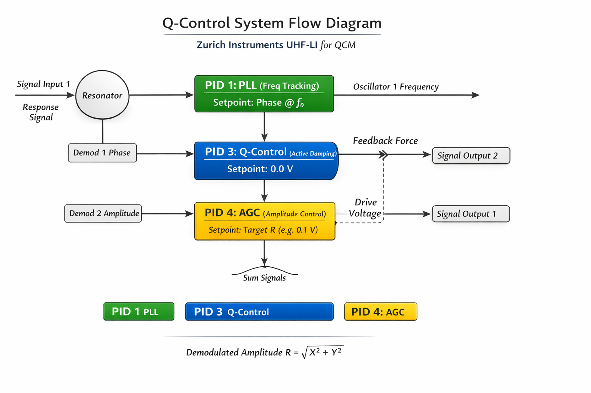
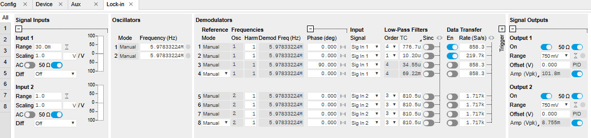

# Practical Guide: Active Q-Control on Zurich Instruments UHF
Based on notes from R. Stomp see the [blog article](https://www.zhinst.com/europe/en/blogs/resonance-engineering-quality-factor-q-control-method).

**Application:** QCM / Resonator Tracking with Active Damping  
**Instrument:** Zurich Instruments UHFLI (UHF-Lock-in)  
**Topology:** 4-Demodulator "Mnemonic" Setup (1=PLL, 2=Measurement, 3=Q, 4=AGC)  

---
## Q-Control diagram for this guide




```mermaid
graph TD
    %% Input Layer
    SigIn[Signal Input 1<br>Response Signal] --> Res(Resonator)
    Res --> Splitter((Internal<br>Routing))

    %% Demodulators
    Splitter --> D1[Demod 1: Phase]
    Splitter --> D2[Demod 2: Amplitude<br>DAQ / Ring-down]
    Splitter --> D3[Demod 3: R]
    Splitter --> D4[Demod 4: R]

    %% PIDs
    D1 --> P1[PID 1: PLL<br>Setpoint: Phase @ f0]
    D3 --> P3[PID 3: Q-Control<br>Setpoint: 0.0 V]
    D4 --> P4[PID 4: AGC<br>Setpoint: Target R]

    %% Outputs
    P1 --> Osc1[Oscillator 1 Frequency]
    P3 --> SigOut2[Signal Output 2<br>Feedback Force]
    P4 --> SigOut1[Signal Output 1<br>Main Drive Voltage]

    %% Physical Hardware Summation
    SigOut1 --> Sum((Sum Signals<br>BNC T-piece))
    SigOut2 --> Sum
    Sum -.->|Physical Feedback| Res
    
    classDef pid1 fill:#2ca02c,stroke:#333,stroke-width:2px,color:#fff;
    classDef pid3 fill:#1f77b4,stroke:#333,stroke-width:2px,color:#fff;
    classDef pid4 fill:#ff7f0e,stroke:#333,stroke-width:2px,color:#fff;
    classDef demod fill:#e0e0e0,stroke:#888,stroke-width:1px;
    
    class P1 pid1;
    class P3 pid3;
    class P4 pid4;
    class D1,D2,D3,D4 demod;

---

## Part 1: The workflow

This section outlines the logical sequence to initialize the system, calibrate the active damping, and lock the resonator for measurement. It is supposed to make a Q-control system for a QCM resonator. In this description, the PLL is activated first then the Q parameters are found, but Q control can be made without the PLL, or the PLL can be engaged after the Q-control enabled (I did not try this yet though).
Note that in order to achieve PLL with a different Q, we'll need the option MF-MD, so that the Sigout2 be assigned to the frequency of OSC1. This is required because the PID3 uses Sigout2.  
The program we use was initially made for a DAQ measurement on the demod 2 with a PLL on demod 1. So, building on that, we'll keep the demod 2 for fast measurements, 1 for PLL anddemods 3 and 4 for Q-control. Obviously, other setups can me made, this is more of a ledger for our in-house work. 


### Step 1: Initial sweep 
Before engaging any control loops, we must find the resonance state of the QCM. **The electrical boundary conditions must match the final setup.**
1. **Turn ON `Signal Output 2`, set its amplitude to 0 V and 50 Ohm impedance.** This engages the internal 50-ohm impedance, which creates a voltage divider with `Signal Output 1` at the physical T-piece.
2. **Turn ON `Signal Output 1` and set its amplitude to double** the desired drive voltage (to compensate for the voltage divider).
3. Run a frequency sweep across the expected resonance (e.g., around 6 MHz), you may need to use Unwrap in the sweep procedure.
4. Calculate the native resonance frequency ($f_0$), bandwidth (BW), and native Q-factor from the amplitude peak (or Pratt circle), the amplitude will be used in pids4, see later.
5. Locate the resonance point; Lorentz fit and Pratt circle should give similar values. Note that in the v3 version of the QCM_PLL program, the resonance point is calculated at the minimum point of the amplitude of the Lorentz fit or by a Pratt circle fit. If the resonance is not symmetrical, use the Pratt parameters which take the resonance where the phase slope ($d\Theta/df$) is largest.
6. Check the slope direction: If it goes down through resonance, the slope is Normal. If it goes up (due to parasitic capacitance or others), the slope is Inverted.

### Step 2 (optional): Frequency tracking (PLL on PID 1)
1. Use the PID Advisor to calculate baseline Proportional (P) and Integral (I) gains for a target bandwidth of about 100 Hz (depending on the crystal BW determined in Step 1 above). In the Advisor use the Resonator model.
2. Apply the polarity rule: If your phase slope is Normal, use Negative P and I gains (those given by Advisor). If it is Inverted, use Positive P and I gains (i.e. invert the values given by the Advisor). **D-Gain is usually 0.**
3. Apply the measured phase setpoint from Step 1 to PID 1.
4. Enable PID 1 (in PLL mode). The lock-in will now continuously track the resonance frequency (for measuring during the deposition increase the lowlimit value). The Phase Locked Loop (PLL) must remain active. If PLL is lost, check the BW parameters, cables, noise ?
5. Set the osc 2 to the same frequency as osc 1: ('/oscs/1/freq', value), or assign SigOut 2 to Osc 1.

### Step 3: Q-Calibration & scanning (PID 3)
We need to calibrate the relationship between the Q-Control P-gain ($K_p$) and the physical damping ($\Gamma$). By stepping down the drive amplitude to half (or 33%), the resonator undergoes a transient decay to a new steady state. Because the signal never drops into the noise floor, the PLL should remain locked throughout the measurement, if it is enabled.

In my case the demodulators look like this:


1. Ensure PID 3 P-gain starts at 0.
2. Define a safe $K_p$ scan array (e.g., -10.0 to to 10.0, increase it in subsecvent trials) for the PID3. Put lower limit and upper limit to about -0.25V and 0.25V.
   **Enable PID 3** (`pids/2/enable -> 1`),
4. **For each $K_p$ value in the array:**

    * Apply $K_p$ to PID 3, and wait 500-1000 ms for the system to settle.
    * Get data from the Demod 2 (you can use DAQ; we now use Poll module, it is fast enough for this purpose).
    * Step the drive signal amplitude down to 50% (or lower) of its initial value (do not disable the output).
    * Measure ~30 - 50 ms for the amplitude to decay to the new steady state.
    * Stop polling and restore the drive signal amplitude to its original value.
    * Wait approximately 3 to 5 times the time constant ($\tau$) for the physical amplitude to stabilize; 10-50 msec is enough.
    * Verify that the PLL remained securely locked during the transient step (larger steps down are better but PLL might be lost during this transient).

    At the end of the array scan, **Disable PID 3** (`pids/2/enable -> 0`).

    * **Safety check:** If the amplitude increases instead of decaying, we have crossed the lasing threshold. Abort the scan and force PID 3 Kp to 0.
    * Fit the valid decay curves to extract the time constant ($\tau$) and calculate the damping rate ($\Gamma$).

### Step 4: Engage steady-state
Once the calibration scan is complete and we have the linear fit parameters ($\Gamma_{native}$ and $\alpha$), we can lock the system into its new Q-state.

**1. Calculate Kp and apply Q-Control**
Calculate the $K_p$ required for the desired target Q. This formula handles both active damping (positive $K_p$) and Q-enhancement (negative $K_p$):

$$K_{p\_target} = \frac{\frac{\pi \cdot f_0}{Q_{target}} - \Gamma_{native}}{\alpha}$$

* Set the value to PID 3: `/{dev}/pids/2/p` -> $K_{p\_target}$
* Enable PID 3 permanently: `/{dev}/pids/2/enable` -> `1`

**2. Scale the PLL (if used)**
Changing the Q-factor directly alters the phase slope ($d\Theta/df$) near resonance. Lowering Q flattens the slope (requiring more PLL gain), while increasing Q steepens the slope (requiring less PLL gain). 
Scale the PID 1 Proportional and Integral gains based on the Q-ratio to maintain your original tracking bandwidth:

$$P_{new} = P_{native} \times \frac{Q_{native}}{Q_{target}}$$

$$I_{new} = I_{native} \times \frac{Q_{native}}{Q_{target}}$$

* Update PID 1 P-gain: `/{dev}/pids/0/p` -> $P_{new}$
* Update PID 1 I-gain: `/{dev}/pids/0/i` -> $I_{new}$

*(Note: the PLL and Q control will work together if the Osc2 follows the frequency of Osc1. This is pssible with the MF option or by referencing the Osc2 to have the Osc1 frequency, via ExtRef)*

**3. Engage the AGC**
Now that the active damping or enhancement has altered the natural amplitude, turn on the AGC to automatically adjust the drive voltage and hold the amplitude at your target setpoint. The setpoint for the PID4 should be the measured amplitude at the resonance point.
* Enable PID 4: `/{dev}/pids/3/enable` -> `1`

**4. Begin experiments**
The multi-loop system should now be functional ! 


---

## Part 2: Hardware & system topology

### A. Hardware wiring & routing
* **Input Signal (`Signal Input 1`):** Resonator response. Feeds all four Demods.
* **Drive Output (`Signal Output 1`):** Main excitation, controlled by PID 4 (AGC). Set Phase to an appopriate value. Routed to Oscillator 1.
* **Q-Feedback (`Signal Output 2`):** Feedback force, controlled by PID 3 (Q-Control) (set demod 3 phase to 90.0 deg). **Must be explicitly routed to Oscillator 1. If this is not possible, the Osc 2 frequency must be set manually** 

> **Hardware:** Physically sum `Signal Output 1` and `Signal Output 2` using a BNC T-piece before connecting to the resonator.


### B. Settings (example for 6 MHz, Q=50k)
All Demods must be referenced to `Oscillator 1`. Enable data streaming ONLY for Demod 2 during the measurement phase (about 200 kSa/sec or more).

| Demodulator | Role | `timeconstant` | `order` | Base Node Path |
| :--- | :--- | :--- | :--- | :--- |
| **Demod 1** | **PLL Source** | `0.2 to 1e-3` | `4` | `/{dev}/demods/0/` |
| **Demod 2** | **Measurement** | `10e-6` | `1` | `/{dev}/demods/1/` |
| **Demod 3** | **Q-Control** | `30e-6` | `4` | `/{dev}/demods/2/` |
| **Demod 4** | **AGC Source** | `100e-3` | `4` | `/{dev}/demods/3/` |


### C. Controller configuration (PIDs)
Configure the PID modules below. PID 2 is skipped. 

| Parameter | PID 1 (`/{dev}/pids/0/`) | PID 3 (`/{dev}/pids/2/`) | PID 4 (`/{dev}/pids/3/`) |
| :--- | :--- | :--- | :--- |
| **Function** | Frequency Tracking | Active Q-Control | Amplitude Stability (AGC) |
| **Target BW** | `50` to `100` Hz | N/A (Pure P-controller) | `0.5` to `2.0` Hz |
| **Module Mode** | **PLL** | **PID** | **PID** |
| **Input Node** | `.../input` (Demod 1 Phase) | `.../input` (Demod 3 R) | `.../input` (Demod 4 R) |
| **Setpoint**| `.../setpoint` (Resonance Phase) | `.../setpoint` -> `0.0` | `.../setpoint` (Target Amp) |
| **Output Node** | `.../output` (Osc 1 Freq) | `.../output` (SigOut 2 Amp) | `.../output` (SigOut 1 Amp) |
| **P-Gain (Kp)** | `.../p` (Sign-Dependent) | `.../p` (Calculated Kp_target) | `.../p` (From Advisor) |
| **I-Gain (Ki)** | `.../i` (Sign-Dependent) | `.../i` -> `0.0` | `.../i` (From Advisor) |
| **D-Gain (Kd)** | `.../d` -> `0.0` | `.../d` -> `0.0` | `.../d` -> `0.0` |


### D. Signal Output routing & phase Configuration
Physically sum `Signal Output 1` and `Signal Output 2` using a BNC T-piece before connecting to the resonator.

| Parameter | Signal Output 1 (Main Drive) | Signal Output 2 (Q-Feedback) |
| :--- | :--- | :--- |
| **Enable Node** | `/{dev}/sigouts/0/on` -> `1` | `/{dev}/sigouts/1/on` -> `1` |
| **Routing** | `/{dev}/sigouts/0/enables/3` -> `1` | `/{dev}/sigouts/1/enables/7` -> `1` |
| **Phase Node** | `/{dev}/demods/3/phaseshift` -> `0.0` | `/{dev}/demods/2/phaseshift` -> `90.0` **(Crucial)** |

* The nodes for signal outputs: ('sigouts/0/amplitudes/3', 0.1) and ('sigouts/1/amplitudes/7', 0.0)

> **Note on PID Polarity:** If parasitic capacitance inverts the phase slope, we must invert the P and I gains for **PID 1 only**. PID3 and PID4 normally use positive polarity, but verify the Q-control sign by checking that increasing $K_p$ increases damping (shorter $\tau$).

---

## Part 3: Mathematical & software reference

### A. The Step-Response fit 
To extract the Q-factor, fit the transient amplitude data from Demod 2 to one or two exponential decays

$$A(t) = A_0 \cdot e^{-t_0/\tau_0} + A_1 \cdot e^{-t_1/\tau_1} + C$$

Here, $C$ represents an offset whose magnitude is related to the 50% (or whatever value) steady-state baseline. There might be a short peak just at the moment of changing the voltage. The data to fit must be only that of the decay, after this peak. There are several ways to do it, I implemented two methods in the v3 code.

**Data slicing with Knee detection:**
 To isolate the pure decay curve, if there is no peak when the SigOut 1 amplitude is changed, the Knee Detector works quite well.
1.  Choose a sliding window size (N) of roughly 20 to 30 points (or approximating a few time delays of Demod 2 filter).
2.  Slide two adjacent windows of size N across the amplitude array. Fit a simple linear regression to each window to extract their local slopes (m1 and m2).
3.  Calculate the difference between the adjacent slopes and search in the array of the differences the index where this difference is maximized. This pinpoints the corner where the flatline drops into the steep exponential transient.
4. Truncate the time and amplitude arrays starting from this index (or shift 5 to 10 points to the right to completely clear the filter's rounded shoulder). Subtract the first time value from the entire sliced time array so the pure transient fit starts at t=0.
This method can be used whether or not the peak is present; if it is, a small number of points for the knee detector should be selected.

**Data slicing with a Max intensity value**
A simpler way, in the case of a peak appearing at the change of the amplitude, is to search for the maximum amplitude and get only the data after this point. 
To prevent getting a spurious point as a maximum, it is better to make averages of a small subsets of 3-5 points, slide these, and search for the max average. 
This method will not work if there is no peak at the moment of ring down.


**Non-linear fit**
Whatever the slicing mechanism selected, the data for one or two exponential decays are fitted with a non linear algorithm. For one decay I use a Levenberg-Marquardt unconstrained fit. 
In the case of a two decays, we assume that one is related to the capacitance discharging and another is related with the resonator. We also assume that the timeconstant of the resonator is larger than that of parasitic noise. I use a TRDL constrained fit, in which one of the decays is faster, that will not be considered later, and the second decay -with a larger timeconstant- is assigned to the resonator.
At the time of this writting, my tests gave timeconstants *smaller* than expected; I think I need to fit only the later part of the decay...

$$\text{Calculate Damping: } \Gamma = \frac{1}{\tau} = \frac{\pi \cdot f_0}{Q}$$

***The measurement of proper time constants is essential for this Ring down method. Depending upon the parasitic capacitance, two exponential decays with closer time constants are difficult to separate properly and in this case this method will fail. An alternative -better method for this case- it to sweep in frequency both Osc1 and Osc2 and detect the Q by a classical fit. This is possible either if the two oscillators are sweeped together, or by assigning the output of PID3 to Osc 2 frequency***

### B. Calibration and safety limits

The PID 3 P-gain (Kp) can be used to either decrease or increase the Q-factor. Based on the negative slope fit shown in the calibration, the relationship between Kp and the effective system damping (Gamma) is:
Gamma(Kp) = Gamma_native - (alpha * Kp)

Where Gamma_native (the y-intercept) is your natural damping, and alpha is the magnitude of the slope obtained by fitting the extracted damping rates against your scanned Kp values.

* **Active damping (Lowering Q):** Kp < 0. Adds artificial viscous damping.
* **Q-Enhancement (Increasing Q):** Kp > 0. Counteracts natural damping.

**Reaching the target Q:**
Once the calibration scan is complete and your slope alpha is accurately fitted, calculate the exact Kp required for your target Q:
Kp_target = (Gamma_native - (pi * f0 / Q_target)) / alpha


**Lasing limit**
When enhancing the Q-factor we risk pushing the total damping to zero, causing the amplitude to grow exponentially (Lasing). For active damping (Kp > 0), this physical limit does not apply.
* **Lasing threshold:** Kp_lasing = -(Gamma_native / alpha)
* **Dynamic limit:** When automating a scan for Q-enhancement, calculate a preliminary fit and cap your negative Kp array at 80% to 90% of Kp_lasing.
* **Hardware limits:** Apply the hardware limits (`pids/2/limitlower` and `limitupper` to reasonable vlaues, e.g. -0.25 and 0.25 V) to act as physical fail-safe against lasing (in the negative direction) or output saturation (in the positive direction).

---

## Demodulator settings for HIPIMS DAQ operation

**Application:** HIPIMS (High Power Impulse Magnetron Sputtering) with  
- PLL active  
- Q-Control active  
- AGC active  
- DAQ streaming on Demod 2  
- Example resonator: ~6 MHz QCM, native Q ≈ 50k  
- Instrument: Zurich Instruments UHFLI  

The goal is to capture fast plasma transients while maintaining stable multi-loop control.

---

### Recommended demodulator configuration

| Demodulator | Role | Recommended Time Constant | Filter Order | Purpose |
|-------------|------|--------------------------|--------------|---------|
| **Demod 1** | **PLL Source** | **0.3 to 1 ms** | 4 | Stable phase tracking without reacting to plasma spikes. |
| **Demod 2** | **DAQ Measurement** | **0.1 to 10 us** | 1 | High temporal resolution, minimal filter delay for transient capture. |
| **Demod 3** | **Q-Control Source** | **20 to 50 us** | 4 | Fast damping/enhancement control without noise amplification. |
| **Demod 4** | **AGC Source** | **50 to 200 ms** | 4 | Slow amplitude stabilization; must not follow pulses. |

---

### Loop Hierarchy requirement

For stable multi-loop operation, the time constants (TC) must be decoupled:

TC(Demod 2) << TC(Demod 3) << TC(Demod 1) << TC(Demod 4)

Fast-to-Slow ordering prevents loop interaction and instability. 

### Important Measurement Note

While Q-control is engaged, the measured damping is:

Gamma_effective = Gamma_native + (alpha * Kp)

Thus, during HIPIMS operation:
* Frequency shifts are physically meaningful and reflect real mass/stress changes.
* Measured Q reflects the actively controlled system, not the native plasma damping.
* To measure native plasma-induced damping, you must disable PID 3 and observe the passive ring-down.

---

### Measurement notes

While Q-control is engaged, the measured damping is:

Gamma_effective = Gamma_native + (alpha * Kp)

Thus, during HIPIMS operation:
* Frequency shifts are physically meaningful and reflect real mass/stress changes.
* Measured Q reflects the actively controlled system, not the native plasma damping.
* To measure native plasma-induced damping, you must disable PID 3 and observe the passive ring-down.

---

### Design rationale

#### Demod 1 — PLL Source
The PLL must track real frequency shifts but ignore fast plasma-induced noise.

- Too fast (<100 µs) → PLL reacts to plasma transients → instability.
- Too slow (>5 ms) → PLL may temporarily lose lock during large frequency shifts.

A range of **0.3–1 ms** provides stable tracking for most HIPIMS regimes.

---

#### Demod 2 — Measurement (DAQ)
This demodulator captures transient behavior during the HIPIMS pulse.

- Time constant must be **much smaller than the plasma rise time**.
- Filter order must be **1** to minimize group delay distortion.
- If plasma rise ≈ 5 µs → use ~2 µs.
- If plasma rise ≈ 20 µs → use 5–10 µs.

This demodulator should always be the fastest in the system.

---

#### Demod 3 — Q-Control
Q-control implements active viscous damping.

- Too fast → amplifies noise.
- Too slow → damping becomes ineffective during fast transients.

A range of **20–50 µs** provides stable damping for a 6 MHz QCM.

---

#### Demod 4 — AGC
AGC maintains constant oscillation amplitude.

It must not respond to:
- Individual HIPIMS pulses
- Plasma ignition spikes

Time constant must be **much larger than pulse duration**.

Example:
- Pulse duration = 100 µs  
- Recommended AGC TC ≥ 50 ms  

---

### Loop hierarchy

For stable multi-loop operation:

$\tau(\text{Demod } 2) \ll \tau(\text{Demod } 3) \ll \tau(\text{Demod } 1) \ll \tau(\text{Demod } 4)$

Fast → Slow ordering prevents loop interaction and instability.

---

### Important measurement note

While Q-control is engaged, the measured damping is:

$\Gamma_{effective} = \Gamma_{native} - \alpha \cdot K_p$

Thus, during HIPIMS operation:
- Frequency shifts are physically meaningful.
- Measured Q reflects the actively controlled system.
- Native damping requires disabling PID 3 and performing a partial ring-down transient.

---
