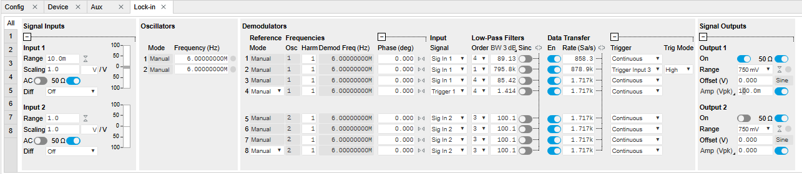
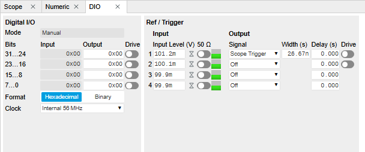
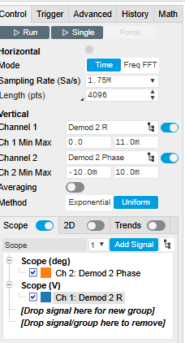
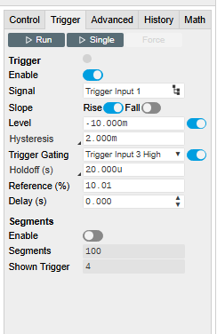

# QCM_PLL Measurement Software Documentation
version 8 march feb 2026

This software is designed to interface with a Zurich Instruments UHF-LI (or similar) to perform high-precision QCM measurements, frequency tracking, and dissipation (Q-factor) control.

---

## 1. Experiment Tab
The entry point of the application for hardware communication and configuration management.

* **Address:** Enter the device ID (e.g., `DEV2091`) of the instrument.
* **Connect:** Establishes communication with the hardware.
* **Load/Save cfg:** Allows importing or exporting instrument settings via `.xml` files. The files saved from the LabOne interface can be used here.
* **Continue (Arrow):** Advances the workflow to the Sweep tab. This option is not active until a valid conection is established with the instrument.

Be sure to load the correct configuration file for the experiment, or adapt in the LabOne UI the parameters that are good for the type of measurement. Plotter is often started by default, so stop it before going further.

---

## 2. Sweep Tab
Used to characterize the resonator's resonance frequency ($f_0$) and Quality Factor ($Q$) before starting a track.

* **Sweep Parameters:** Set the **start/end** frequencies (typically around 5-6 MHz for standard crystals) and the number of **steps**. The range can be set manually or with the two cursors on the plot.
* **R, theta:** Displays the amplitude ($R$) and phase response together with the fitted values, at the end of a scan.
* **Nyquist:** Displays the real vs. imaginary part of the admittance/impedance, used for circular PRatt fitting.
* **Lorentz/Pratt Fit:** Automatically extracts:
    * **freq_0 ($f_0$):** Center resonance frequency.
    * **BW:** Bandwidth at half-maximum.
    * **Q:** The Quality factor ($f_0 / BW$).
Configuration file: PLL or PLL_Scope
Note, a Lorentz fit and a Pratt circle fit will be made at the end of the scan. The parameters that will be considered when passing to the next step will be either Lorentz or Pratt, whichever is selected (e.g. visible).
---

## 3. Track f (Frequency Tracking)
The core real-time measurement tab using a PID loop to lock onto the resonance frequency.

* **Track f0 / ph:** Displays the current locked frequency and phase setpoint.
* **PID mode:** Usually set to **PI** for frequency tracking. 
* **BW factor:** Adjusts the tracking speed vs. stability; (around 0.8 to 1 seems a good value)
* **Advisor:** Automatically calculates optimal PID gains based on the sweep data and set these values to the PID. The bandwidth value is critical here; there is a compromise to be made between accuracy and stability.
* **PLL Lock:** Indicators turn red when the system is not successfully "locked" to the resonance. A PLL lock LED indicator will also be ON in the bottom right part of the window.
* **Live Graph:** Monitors Frequency, Amplitude ($R$), and Phase over time.
* Note on "Record": If "Record" is ON the data is saved continuously to a TMDS file and a CSV text file. If you select a large number of Samples/sec, those files will be very large.

---

## 4. Q-control Tab
Dedicated to active dissipation control or monitoring change in the damping of the crystal.

* **Actual Q:** The actul value recorder of the Quality factor. It is taken from the Sweep fit parameters.
* **Target Q:** Setpoint for active feedback to increase or decrease the effective Q.
* **Knee Detector:** Parameter for identifying the transition in the decay or response curve.
* **Gamma vs Kp:** Plots the relationship between the feedback gain and the damping coefficient.

_At this moment this part is not fully functional._
---

## 5. Scope
Configures high-speed data capture for transient events.
For this configuration you will need to load the PLL_Scope file or configure the LabOne app.

This is a Gated measurement, the data is transferred only when the Trigger3 is in High state. The scope is triggered by Trigger 1, in the DIO module you should have something like this, and a connection between Trigger 3 and Trigger 1 should be made (I know, there are simpler ways... )

* **Points:** Defines the number of points to acquire; the smallest number is 4096.
* **Trigger:** Set the source (e.g., Trigger 1) at which data recording starts.

 
* **TC /usec:** The time constant for the digital filter for the Demods 2.

The duration of the measurement is automatically established based on the number of points and the rate of transfer. In this configuration transfers up to 1.8G Sa/sec are possible. Be conservative, there is a memory limit in the DIG-Scope module and saving millions of points is useless.
The ranges for the two channels should be set by user. There is a autorange option for this but user selected values is faster.

---

## 6. Status Tab
An overview and system control panel.

* **Status Window:** Displays a log of system messages, errors, and connection confirmations. These are also logged in the TDMS file.
* **Plotter:** Open the Saurbrey.html program to analyse the data in real time (Chrome or Edge are required for real time visialization). The text and TDMS files are located in the /Documents/Labview Data/year_month/timestamp.txt. Only txt files can be read with the Sauerbrey program. For reading TDMS files you can use Excel or other programs (one of those is listed in my repositories).
* **Quit:** Safely stops the instrument outputs and closes the LabVIEW application.
